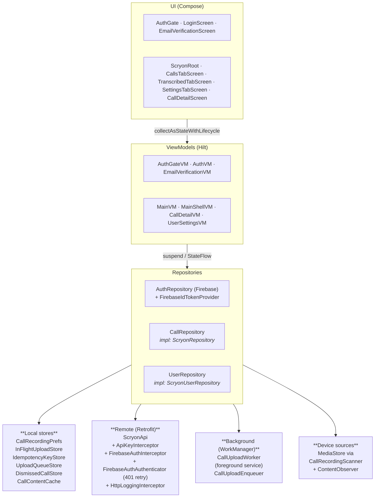
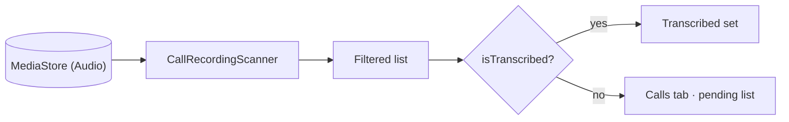

# Architecture

A single-module app following a Clean-ish layering with strict boundaries.

## Layers



## Hard rules

1. **UI never imports Retrofit, Firebase, or Hilt internals.** Only ViewModels and domain models cross that boundary.
2. **Repositories return domain models** (`CompletedCallUi`, `UserProfile`, …), not DTOs.
3. **Local stores are namespaced by Firebase `uid`.** Two users on one device never collide.
4. **Raw audio is never persisted locally.** Completed-call **transcript + analysis JSON** are cached in app-private storage (`CallContentCache`) to avoid re-downloading on every detail open; the cache is wiped on sign-out, account delete, and per-call delete.

## Directory layout

```
app/src/main/java/com/scryon/
├── MainActivity.kt              Single Activity, wraps content in AuthGate.
├── ScryonApplication.kt         Hilt application; Configuration.Provider for Hilt-Work;
│                                re-arms MediaStore observer + uploads notification channel.
│
├── data/
│   ├── auth/                    Firebase wrappers — AuthRepository, FirebaseIdTokenProvider
│   │                            (cached Bearer token), Google + Phone helpers, SignUpResult.
│   ├── local/                   SharedPreferences-backed stores + scanner DTO. Includes
│   │                            UploadQueueStore (pre-accept), DismissedCallStore, and
│   │                            CallContentCache (on-disk transcript/analysis JSON).
│   ├── remote/                  Retrofit interface, DTOs, interceptors (ApiKey +
│   │                            FirebaseAuth) and FirebaseAuthAuthenticator (401 retry),
│   │                            Moshi adapters, ScryonError hierarchy + mapper.
│   ├── repository/              ScryonRepository, ScryonUserRepository (impls).
│   └── scanner/                 CallRecordingScanner — MediaStore filter heuristics.
│
├── di/                          Hilt modules (NetworkModule, RepositoryModule, AppModule)
│                                + ScryonApiConfig (BuildConfig wrapper).
│
├── domain/
│   ├── model/                   ScryonModels.kt, UserModels.kt — UI-friendly domain types.
│   └── repository/              CallRepository, UserRepository (interfaces).
│
├── notifications/               BootCompletedReceiver, ContentObserver, periodic-scan
│                                worker, PostCallNotificationHelper, and
│                                UploadProgressNotificationHelper (foreground-service
│                                notification for CallUploadWorker).
│
├── work/                        WorkManager pipeline for durable uploads —
│                                CallUploadWorker (HiltWorker, foreground service) +
│                                CallUploadEnqueuer (single entry point + cancel).
│
├── ui/
│   ├── auth/                    LoginScreen, EmailVerificationScreen, AuthGate.
│   ├── components/              GlassCard, StatusChip, TagChip, EmptyState, StatsCard,
│   │                            ScryonBottomBar.
│   ├── navigation/              ScryonRoutes (string constants + tab enum).
│   ├── shell/                   ScryonRoot scaffold + tabs/ screens + shared components.
│   └── theme/                   Colours, typography, Material3 mapping.
│
├── util/                        RecordingPermissions.
└── viewmodel/                   All @HiltViewModel classes.
```

## Coding conventions

- **Compose first.** No XML layouts. Theme tokens via `LocalScryonColors.current`.
- **ViewModels return `StateFlow`**, not `LiveData`. UI uses `collectAsStateWithLifecycle()`.
- **Repositories suspend** for I/O. They throw mapped `ScryonError` subclasses; ViewModels translate to user-facing strings.
- **Hilt** wires everything from `Application` down. New singletons go in a `@Module` under `di/`.
- **Naming.** DTOs in `data/remote/dto/`. Domain models in `domain/model/`. Repository interfaces in `domain/repository/`; impls in `data/repository/`.
- **No raw audio on disk.** Small JSON blobs live in `local/` SharedPreferences stores; completed-call transcript + analysis JSON are cached under `filesDir/scryon-call-cache/<uid>/` and cleared on sign-out / delete.
- **Comments explain *why*, not *what*.** Avoid narrating obvious code.

## Discovering local recordings

`CallRecordingScanner` heuristically classifies a `MediaStore.Audio` row as a call recording based on its `DISPLAY_NAME`, `RELATIVE_PATH` / `DATA`, and `MIME_TYPE`. Positive tokens: `call`, `recorder`, `voice memo`, `acr/`, etc. Negative tokens: `/ringtones/`, `/whatsapp/media/whatsapp`, `telegram`, etc. The full lists live in `data/scanner/CallRecordingScanner.kt`.

The same scanner powers the background **New-recording** notification flow — see [Notifications](notifications.md).



## What's next

- **[Authentication](auth.md)** — auth gate + sign-in flows.
- **[Upload pipeline](upload-pipeline.md)** — durable WorkManager uploads.
- **[Networking](networking.md)** — interceptor chain and error mapping.
