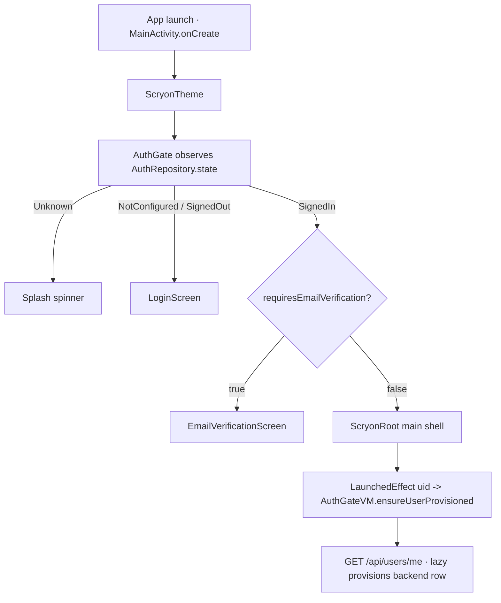
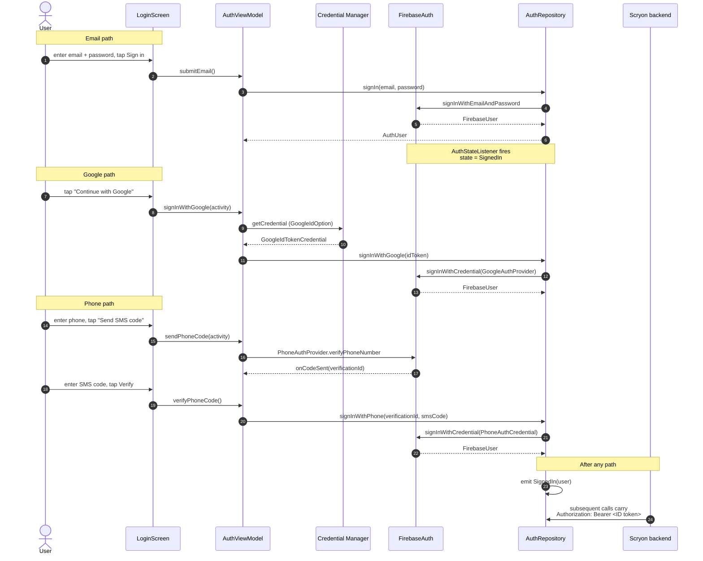

# Authentication

The Android app uses **Firebase Authentication** for identity, then passes the Firebase **ID token** as a Bearer header to every backend request. The backend identifies the user from the verified token — there is no separate Scryon account system.

## Auth gate



Key points:

- `AuthRepository.state` is a `StateFlow<AuthState>`; the gate is purely reactive.
- The `LaunchedEffect` is keyed on `uid` so it fires once per signed-in user — never on plain recompositions.
- `requiresEmailVerification` is `true` only for the `password` provider. Google / Phone sign-in skips that step.

## Sign-in flows



### Email + password

- **Sign-up** sends the Firebase verification email *once* as part of `signUp` (default template first → falls back to `ActionCodeSettings` if that fails). The outcome is captured in `SignUpResult` and read once by `EmailVerificationViewModel` — the screen does **not** fire a second send on first open (which used to hit Firebase rate limits). Subsequent resends are gated by a 60-second cooldown.
- The user is held on `EmailVerificationScreen` until `user.reload()` reports `isEmailVerified`.
- **Forgot password** uses `FirebaseAuth.sendPasswordResetEmail`.

### Google

- Uses the **Credential Manager** API (the modern replacement for `GoogleSignInClient`).
- Requires `FIREBASE_WEB_CLIENT_ID` in `local.properties` and proper SHA-1 fingerprints in Firebase Console.

### Phone

- Supports SMS auto-retrieval. If Firebase calls `onVerificationCompleted` on-device we skip the manual code step.

## ID-token caching

`FirebaseIdTokenProvider` (singleton):

- **Caches** the latest Bearer token in memory for ~50 minutes.
- **Serialises** fetches behind a lock so parallel OkHttp calls never race on `getIdToken(true)`.
- **Listens** for Firebase uid changes and clears the cache.
- **Primes** the cache right after a successful `signIn` / `signInWithGoogle`.
- **Clears** explicitly on `signOut()`.

The provider uses `Tasks.await(...)` rather than `runBlocking` so OkHttp's request threads can't deadlock.

## 401 retry

`FirebaseAuthAuthenticator` is attached to OkHttp via `.authenticator(...)`. On a 401 it force-refreshes the token (`getIdToken(true)`) and retries the request once — covers the case where the cached token expired between fetch and server validation.

## Settings → Auth diagnostics

A signed-in user can see:

- Their Firebase **uid**.
- The cached **Bearer token** (preview by default; *Reveal full* + *Copy*).
- A *Refresh* and *Force refresh* button.

This is the fastest path to diagnose 401s — the same token can be tested against the backend with `curl`:

```bash
curl https://api.scryon.app/api/users/me \
  -H "X-API-Key: $SCRYON_API_KEY" \
  -H "Authorization: Bearer $TOKEN"
```

## Sign-out is destructive

`AuthRepository.signOut()` wipes every per-uid local store and clears the cached ID token *before* calling `FirebaseAuth.signOut()` so the lookups still resolve to the user's namespace:

- `InFlightUploadStore`
- `IdempotencyKeyStore`
- `UploadQueueStore`
- `DismissedCallStore`
- `CallRecordingPrefs`
- `CallContentCache` (`clearForUid(uid)`)
- `FirebaseIdTokenProvider` cache

After sign-out, the app effectively starts over with no per-user data on disk.

## Account deletion

`DELETE /api/users/me` returns 204. The client then calls `FirebaseAuth.user.delete()` and signs out. If Firebase rejects the delete with `RECENT_LOGIN_REQUIRED`, the UI asks the user to sign out and back in, then retry.
