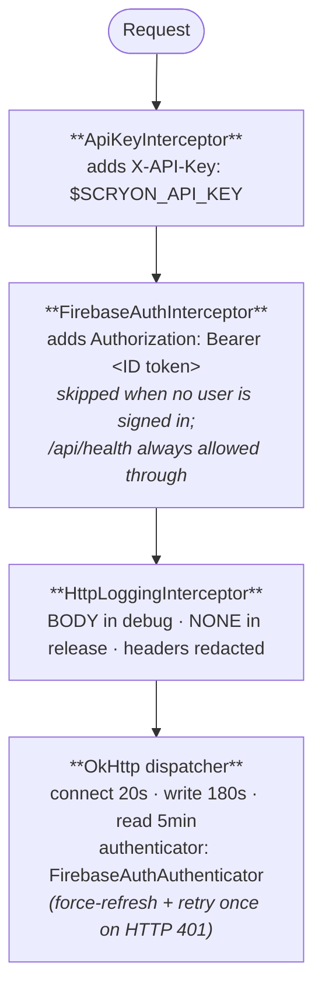

# Networking

The app talks to the backend over HTTPS using **Retrofit 2 + OkHttp 4 + Moshi**. Auth headers, token refresh, and error mapping are all centralised in a small set of interceptors.

## Interceptor chain



## Token caching

`FirebaseIdTokenProvider` is a singleton holding the latest Firebase ID token:

- **In-memory cache** with a TTL of ~50 minutes.
- **Serialised fetches** behind a lock — parallel OkHttp requests never race on `getIdToken(true)`.
- **Uses `Tasks.await(...)`** rather than `runBlocking` so OkHttp's request threads can't deadlock.
- **Cleared** when the Firebase uid changes (sign-out, account switch) and on explicit `signOut()`.
- **Primed** by `signIn` / `signInWithGoogle` right after a successful sign-in, so the very first request after auth has a token ready.

## 401 retry

`FirebaseAuthAuthenticator` is attached to OkHttp via `.authenticator(...)`. On a 401 it:

1. Force-refreshes the token via `getIdToken(true)`.
2. Retries the original request **once** with the new token.

This covers the (rare) case where the cached token expired in the window between local fetch and server validation.

If the second attempt also 401s, the error surfaces as `ScryonError.Unauthorized` and bubbles up to the ViewModel.

## Debug logcat

Successful token fetches are logged at `Log.i` with tag `FirebaseIdToken` — uid, length, preview. Failures log at `Log.w`/`Log.e` with the cause.

Filter on the tag to debug *"Missing or invalid Authorization Bearer token"* responses:

```bash
adb logcat -s FirebaseIdToken:V OkHttp:V
```

## Error mapping

`ScryonErrorMapper.map(Throwable, Moshi)` converts low-level errors into a sealed `ScryonError` hierarchy that ViewModels and screens can branch on cleanly:

| Source | → |
|---|---|
| `IOException` | `ScryonError.Network` |
| `HttpException 400` | `BadRequest(apiMessage)` |
| `HttpException 401` | `Unauthorized(apiMessage)` |
| `HttpException 404` | `NotFound(apiMessage)` |
| `HttpException 413` | `PayloadTooLarge(apiMessage)` |
| `HttpException 502` | `Upstream(apiMessage)` |
| `HttpException 5xx` | `Server(apiMessage)` |
| anything else | `Unknown` |

`apiMessage` is the `message` field of the standard `ApiErrorDto`, falling back to the raw body (first 280 chars).

## JSON

- **Moshi** with `KotlinJsonAdapterFactory`.
- **Custom adapters**:
  - `InstantJsonAdapter` — ISO-8601 ↔ `Instant`.
  - `LocalDateJsonAdapter` — ISO-8601 ↔ `LocalDate`.
  - `CallStatusJsonAdapter` — maps unknown enum strings to `UNKNOWN` rather than throwing.

The unknown-enum-as-`UNKNOWN` behaviour is critical for forward compatibility — the backend can introduce new statuses without breaking older clients.

## Timeouts

| Phase | Timeout |
|---|---|
| Connect | 20 s |
| Write | 180 s (uploads can be slow on cellular) |
| Read | 5 min (analysis polling can be long-running for very large calls — not the upload itself) |

Tuning these lives in `NetworkModule.provideOkHttpClient`.

## Health check

`GET /api/health` is the one endpoint that **does not** require `Authorization: Bearer …`. It still requires `X-API-Key`. The interceptor explicitly allows it through when the user is not yet signed in.

## Related

- **[Authentication](auth.md)** — Firebase sign-in and token lifecycle.
- **[Upload pipeline](upload-pipeline.md)** — where the multipart upload is built.
- **[Backend API reference](../api/overview.md)** — endpoint shapes the app calls.
