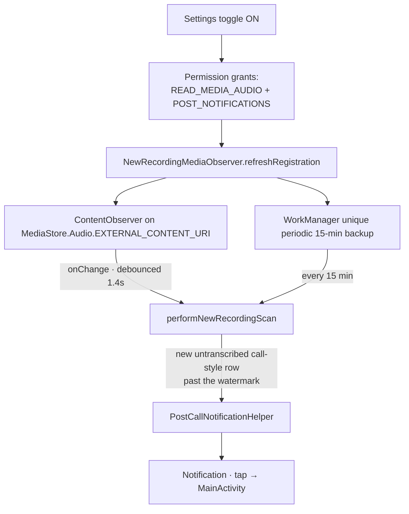

# New-recording notifications

An opt-in feature surfaced in **Settings → Notifications**. When enabled, the app watches `MediaStore` for new call-style recordings and posts a notification so the user can open the app and transcribe them.

## Flow

## Watermark

When the user enables the toggle, the app records the current `DATE_MODIFIED` timestamp as a **watermark** in `CallRecordingPrefs`. Only files with a `DATE_MODIFIED` *newer* than the watermark trigger a notification — old library files never fire.

## Dedupe

`notified_new_recording_ids` in `CallRecordingPrefs` is a set of MediaStore IDs already notified. The same file never fires twice, even across app restarts.

## Boot recovery

`BootCompletedReceiver` re-registers the `ContentObserver` after device reboot so the feature survives a restart without the user re-enabling it.

## Backup scan

A WorkManager **unique periodic** job (every 15 minutes) acts as a safety net in case the `ContentObserver` misses an event (some OEMs throttle or batch MediaStore notifications).

## No phone-state permission

Detection is purely MediaStore-based. The app does **not** need `READ_PHONE_STATE` or call logs to detect new recordings.

## Notification tap behaviour

Tapping the notification opens `MainActivity`. `EXTRA_HIGHLIGHT_RECORDING_ID` is plumbed through the intent, but the Calls tab does not yet scroll-to / pulse the highlighted row (roadmap item).

## Disabling

Turning the toggle off in Settings:

1. Unregisters the `ContentObserver`.
2. Cancels the periodic WorkManager job.
3. Leaves the watermark and dedupe set intact (so re-enabling doesn't notify for old files).

## Related

- **[Permissions](permissions.md)** — `POST_NOTIFICATIONS` and `READ_MEDIA_AUDIO` requirements.
- **[Architecture](architecture.md)** — `CallRecordingScanner` heuristics.
