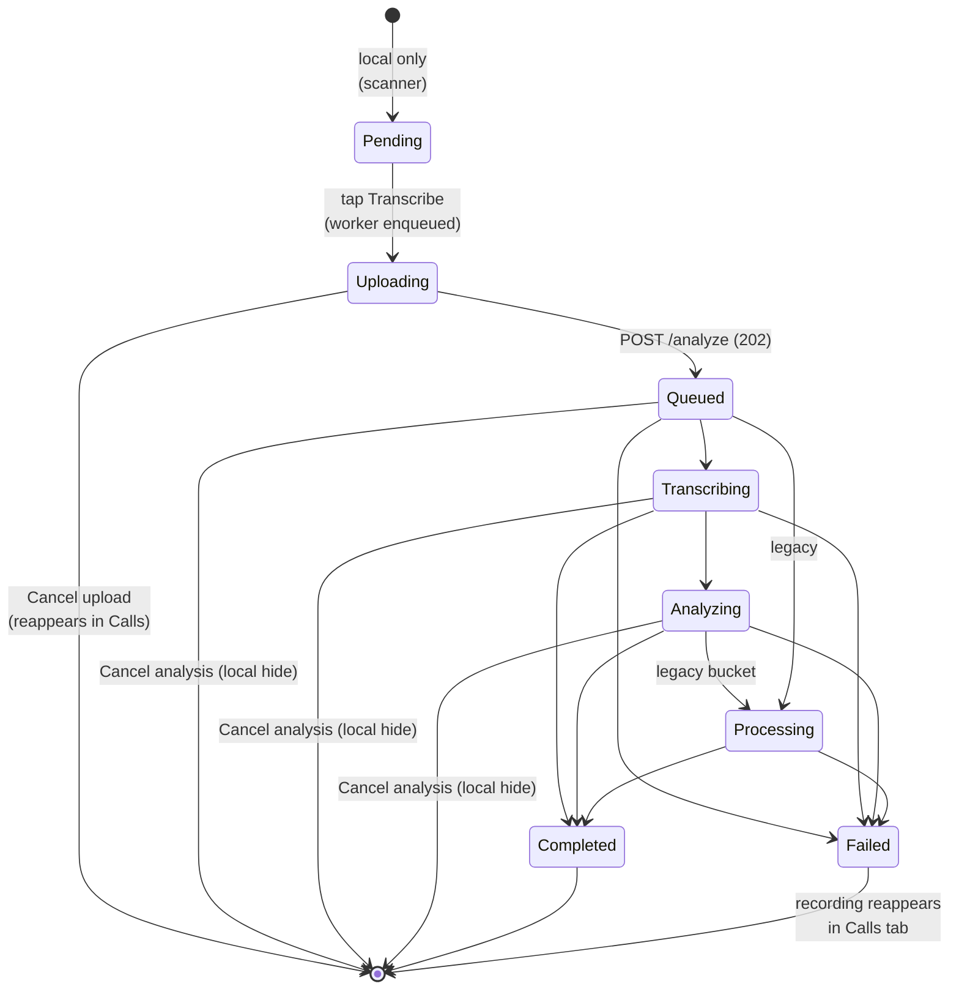

# Status lifecycle

The backend reports each call's `status` over the lifecycle of its processing. The Android app maps wire statuses to a domain enum and a UI chip.

## State machine

## Mapping table

| Wire (`CallStatus`) | Domain (`TranscriptionStatus`) | UI |
|---|---|---|
| — (client-only) | `Uploading` | "Uploading" chip (synthetic row) |
| `QUEUED` | `Queued` | "Queued" chip |
| `TRANSCRIBING` | `Transcribing` | "Transcribing" |
| `ANALYZING` | `Analyzing` | "Analyzing" |
| `PROCESSING` | `Processing` | "Processing" (legacy fallback) |
| `COMPLETED` | `Completed` | green chip |
| `FAILED` | `Failed` | red chip + error |
| `UNKNOWN` | `null` (row hidden) | — |

## Client-only states

### `Uploading`

The worker has been enqueued but `POST /api/calls/analyze` has not yet returned an accepted `callId`. The row is **synthetic** — contributed to the Transcribed list by `MainShellViewModel.mergeUploadsAndCompleted` from `UploadQueueStore` entries — and disappears as soon as the matching real backend row arrives (matched by `mediaId` via `InFlightUploadStore`).

### `Pending`

Strictly speaking this is "I see a recording on disk that hasn't been transcribed yet." It's only visible on the **Calls** tab.

## Legacy: `PROCESSING`

`PROCESSING` is the legacy bucket; new uploads start as `QUEUED` and transition through the specific states (`TRANSCRIBING` → `ANALYZING` → `COMPLETED`). The client still handles it as a generic "in progress" state for backwards compatibility.

## What triggers transitions

| Transition | Trigger |
|---|---|
| `Pending → Uploading` | User taps **Transcribe**; `CallUploadEnqueuer` writes to `UploadQueueStore` and enqueues the worker. |
| `Uploading → Queued` | `CallUploadWorker.doWork` gets a 202 from `POST /analyze`. |
| `Queued → Transcribing → Analyzing → Completed/Failed` | Server-side pipeline; client observes via `GET /api/calls/status`. |
| `Uploading → (gone)` | User taps **Cancel upload**; `WorkManager.cancelUniqueWork(...)` + `UploadQueueStore.dequeue`. |
| `Queued/Transcribing/Analyzing → (locally hidden)` | User taps **Cancel analysis**; added to `DismissedCallStore`. Polling stops; the row never returns. Server may still complete the work but it won't appear in this user's app. |
| `Completed/Failed → (gone)` | User long-presses + bulk-deletes; `DELETE /api/calls`. |

> Scryon's REST API does not currently have a server-side cancel endpoint. "Cancel analysis" is a **local hide** only — see [Delete & cancel](delete-and-cancel.md).

## Polling

When the Transcribed tab is visible (or the detail screen of an in-flight call is open), `MainShellViewModel` polls `GET /api/calls/status?ids=…` with `inFlightIds` (`Queued`, `Transcribing`, `Analyzing`, `Processing`) — synthetic upload IDs and `DismissedCallStore` entries are excluded. The server hints the next interval via `nextPollMs`; the client honours it verbatim, clamped to **1 s – 60 s**.
