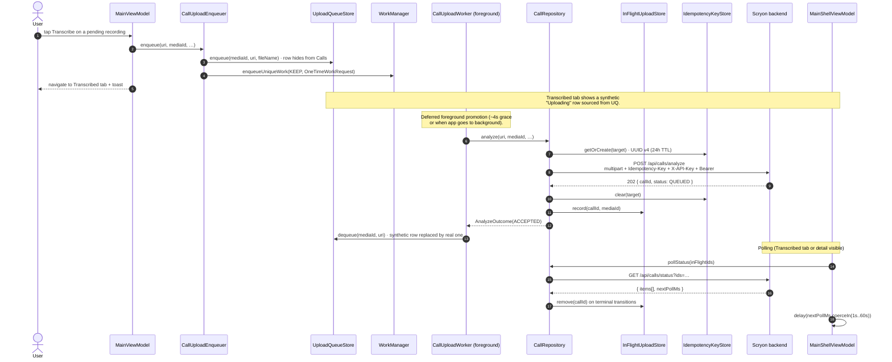
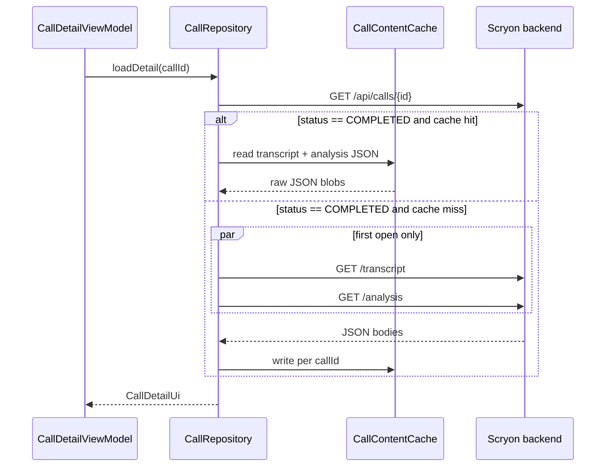

# Upload pipeline

Uploads are **durable**. Tapping *Transcribe* enqueues a one-shot WorkManager job (`CallUploadWorker`) that survives app kill, swipe-from-recents, and process death. The activity's `viewModelScope` is no longer in the upload critical path.

## End-to-end flow

## Idempotency model

- A **UUID v4** is minted per *upload target* (`media:<id>` or `uri:<contentUri>`) and persisted in `IdempotencyKeyStore` for **24 hours**.
- A **network error retains the key**, so worker retries reuse it; the backend honours `Idempotency-Key` for 24 h and returns the existing call instead of creating a duplicate row.
- A **structured server response** (`ACCEPTED` or `FAILED`) clears the key — the next user-initiated attempt mints a fresh one.

This means re-tapping Transcribe after a transient network failure is always safe — the backend will dedupe.

## Worker behaviour

- **One unique work name** per recording: `scryon-upload:media:<id>` or `scryon-upload:uri:<hash>`. With `ExistingWorkPolicy.KEEP`, re-tapping Transcribe while a job is running is a no-op.
- **`NetworkType.CONNECTED`** constraint.
- **Exponential backoff** (10 s base) up to **5 attempts** on transient errors (`Network`, `Server`, `Upstream`).
- **4xx errors** (`Unauthorized`, `BadRequest`, `NotFound`, `PayloadTooLarge`) drop the queue entry so the recording reappears under Calls.
- **Deferred foreground service.** `setForeground` is *not* called immediately — the worker polls `ProcessLifecycleOwner` and only promotes once the app is backgrounded, or after a 4-second grace period. This prevents the "app disappeared" feeling that an immediate foreground notification caused on some devices. When promoted, the notification uses channel `scryon_uploads` and `FOREGROUND_SERVICE_TYPE_DATA_SYNC` on Android 14+.
- **WorkManager initializer is disabled** in the manifest; `ScryonApplication` implements `Configuration.Provider` and supplies the Hilt `WorkerFactory` so `@HiltWorker` constructor injection works.

## Polling cadence

- The server hints the next poll interval via `nextPollMs`. The client honours it verbatim, **clamped to 1 000 – 60 000 ms** as a safety net.
- A request failure switches to a local **exponential backoff (3 s → 15 s)** until the next success.
- Polling is started/stopped by **Transcribed** tab visibility. The call-detail screen keeps it running so popping back shows fresh statuses. Synthetic upload IDs and `DismissedCallStore` entries are excluded from the poll targets.

## Call-log enrichment

When the user has granted `READ_CALL_LOG`, `CallLogMatcher` is invoked from `CallUploadWorker.doWork` *before* each upload. It matches the recording's `recordedAt` − `duration` against `CallLog.Calls.DATE` (with 3-minute time and ±15-s duration tolerances) and produces an `UploadMetadata` carrying:

- `contactName`, `contactId` (CallLog row id), `phoneNumber`
- `direction` — `INCOMING` / `OUTGOING` / `UNKNOWN` (rejected / missed treated as incoming)
- `durationSeconds`, `recordedAt` (ISO-8601)
- `title` / `fileName` overrides

The worker serialises this as a `metadata` JSON multipart part (`application/json`) on `POST /api/calls/analyze`. When the part is present the backend **ignores the flat upload params** and uses the structured metadata instead, producing nicer USER vs CONTACT diarisation and assignee labels on action items.

If the permission is denied or no row matches, the worker skips the metadata part and the upload proceeds with the same flat params used in earlier builds.

## Call detail (transcript + analysis)

Transcript and analysis are nullable on the UI side — if the server hasn't produced them yet the screen shows just the detail header and a status chip.

### `CallContentCache`

For `COMPLETED` calls only, the first successful fetch of `/transcript` and `/analysis` is written to `filesDir/scryon-call-cache/<uid>/<callId>.{transcript|analysis}.v1.json`. Subsequent detail opens parse from disk — **no network** for those two endpoints.

| Event | Cache behaviour |
|---|---|
| First detail open (completed call) | Network fetch → write JSON → parse |
| Repeat detail open | Read JSON → parse (skip network) |
| Stale / unparseable blob | Delete file → one network retry |
| `DELETE /api/calls` (success / notFound) | `invalidate(callIds)` |
| Sign-out / Firebase account delete | `clearForUid(uid)` |

Not cached: call envelope (`GET /api/calls/{id}`), list (`GET /api/calls`), status poll, or action items (`GET /api/actions` — mutable). No LRU eviction in v1; growth is bounded by how many completed calls the user keeps.

## Related

- **[Status lifecycle](status-lifecycle.md)** — what states the row transitions through.
- **[Local stores](local-stores.md)** — `UploadQueueStore`, `InFlightUploadStore`, `IdempotencyKeyStore`.
- **[Networking](networking.md)** — interceptor chain and error mapping.
