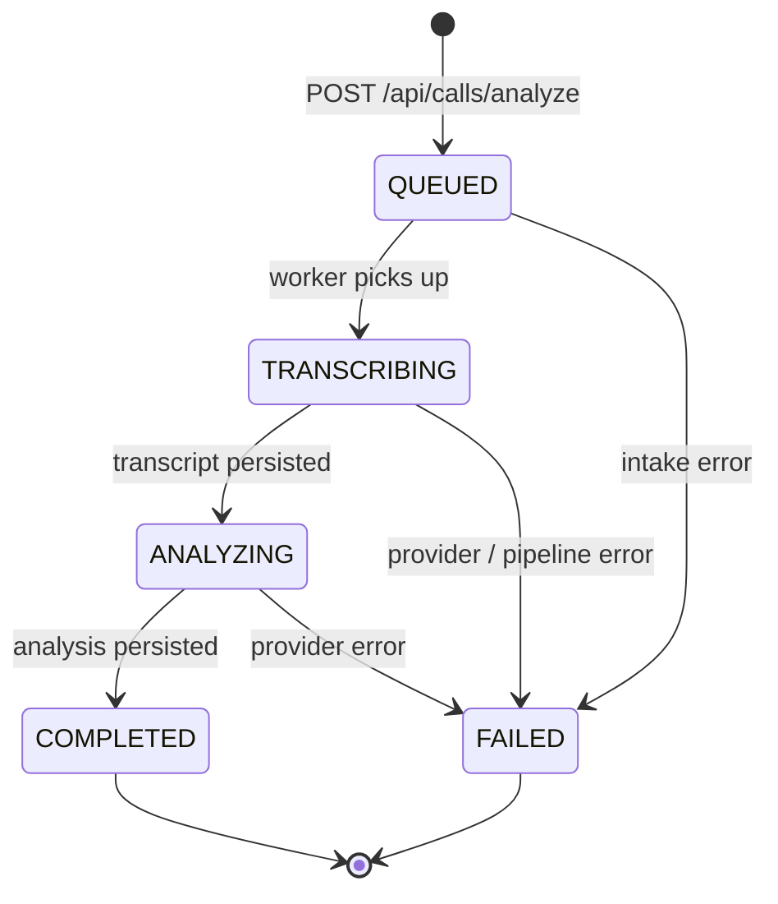

# Call processing pipeline

The async pipeline transforms an uploaded audio file into a transcribed, diarized, analysed call. Every stage is observable, idempotent, and recoverable.

## Stages

Within `TRANSCRIBING` the worker executes these sub-stages in order:

| # | Stage | Service | Notes |
|---|---|---|---|
| 1 | `AUDIO_PREPROCESSED` | `AudioPreprocessingService` | Mono · 16 kHz · loudnorm · denoise. Falls back to original audio on failure. |
| 2 | `DIARIZED` | `DiarizationService` (pyannoteAI) | Optional. Hints `numSpeakers: 2` for phone calls. |
| 3 | `TRANSCRIBED` | `TranscriptionClient` (Lemonfox) | Word-level Whisper output. Optionally async via callback. |
| 4 | `TRANSCRIPT_ALIGNED` | `TranscriptAlignmentService` | Word ⨯ diarization-turn overlap. |
| 5 | `TRANSCRIPT_NORMALIZED` | `TranscriptNormalizationService` | Stable `spk_N` IDs, segment merging, stutter cleanup. |
| 6 | `VOICE_MATCH_STARTED` | `VoiceMatchService` | Optional. Pre-labels the authenticated user if a voice profile exists. |
| 7 | `SPEAKER_REFINED` | `SpeakerNameResolutionService` | Names speakers from metadata + voice match + transcript text. |
| 8 | `ANALYZED` | `AnalysisClient` (OpenAI) | Structured business analysis. |
| 9 | `ACTION_ITEMS_EXTRACTED` | `ActionItemService` | Persists action items. |

Each is wrapped in a `ProcessingEventLogger` event and a `ScryonMetrics` timer.

## State machine

| Status | Meaning |
|---|---|
| `QUEUED` | Accepted by the API; awaiting worker pickup. |
| `TRANSCRIBING` | One of the pipeline stages above is in flight. |
| `ANALYZING` | The LLM is producing the analysis. |
| `COMPLETED` | All artifacts persisted; transcripts and analysis are queryable. |
| `FAILED` | A non-recoverable error; `errorReason` carries a short, opaque code. |

Transitions are persisted by `CallPersistenceService` and are guarded so a worker restart never produces a divergent state.

## Idempotency

- Workers claim rows with `SELECT ... FOR UPDATE SKIP LOCKED`.
- Every artifact write is keyed by `(callId, artifactType)` and replaces in place.
- Re-running the pipeline on a `COMPLETED` call is a deliberate, idempotent operation that re-uses prior artifacts where possible (see `CallProcessingService.runPipeline`).

## Failure handling

| Failure | Behaviour |
|---|---|
| Preprocessing (ffmpeg) | Log + skip; use original audio. |
| Diarization | Log + fall back to Lemonfox built-in diarization (single-speaker if it can't either). |
| Transcription | Hard fail. The call moves to `FAILED`. |
| Alignment / normalization | Hard fail. |
| Voice match | Soft fail; transcript still ships, no `VOICE_EMBEDDING` label. |
| Speaker resolution | Soft fail; transcript ships with `Speaker N` labels. |
| Analysis | Hard fail. |
| Action items | Soft fail; transcript and analysis still surfaced. |

Stuck rows are reaped by `StaleJobSweeper` after `SCRYON_STALE_JOB_TIMEOUT_MINUTES`.

## Privacy along the pipeline

| Stage | What lives where | What we never store |
|---|---|---|
| Upload | TEMP_AUDIO key (S3) for up to `OBJECT_STORAGE_TEMP_AUDIO_TTL_HOURS` | Permanent audio. |
| Preprocessing | In-memory bytes | Local temp files (suppressed via multipart threshold). |
| Diarization | Raw provider response as `DIARIZATION_JSON` artifact | Provider tokens in logs. |
| Transcription | Raw Whisper response as `RAW_TRANSCRIPT_JSON` artifact | Transcript text in `INFO` logs when `REDACT_TRANSCRIPTS=true`. |
| Normalization | `NORMALIZED_TRANSCRIPT_JSON` artifact | Anything we'd be ashamed to show the speaker. |
| Voice match | `voiceMatchScore` (single float) on the transcript | Embedding vectors are kept opaque per provider; we never decode them. |
| Analysis | `ANALYSIS_JSON` artifact | Sensitive text in metrics or logs. |

See [Privacy & security](../privacy-and-security.md) for the full contract.
