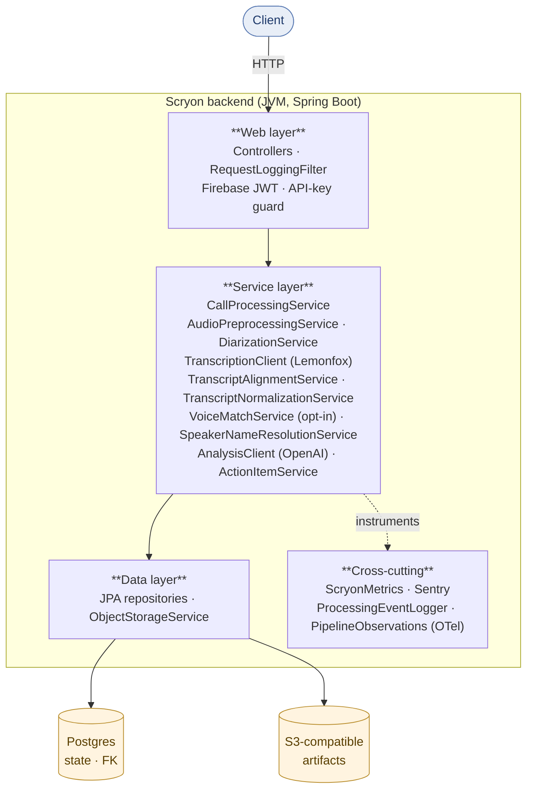

# System overview

Scryon is a single Spring Boot service that wraps three external providers — pyannoteAI (diarization + voice), Lemonfox (transcription), and OpenAI (analysis) — behind a clean REST API. State lives in Postgres; artifacts live in S3-compatible object storage.

## Component diagram

External providers (HTTP, configurable):

| Provider | Used for | Required |
|---|---|---|
| Lemonfox / Whisper | Word-level transcription | yes |
| pyannoteAI | Speaker diarization + voice embedding | optional, opt-in |
| OpenAI (or compatible) | LLM analysis | yes |
| Firebase Admin | Auth (production) | recommended |
| Sentry | Error tracking | optional |
| OTLP collector (Tempo / Grafana Agent / etc.) | Distributed tracing | optional |

## Runtime topology

Scryon is designed to run as a single horizontally-scalable instance. The async pipeline does not require a queue broker — Postgres `FOR UPDATE SKIP LOCKED` is sufficient at current scale. State machines are idempotent so restarting mid-pipeline is always safe.

| Concern | Approach |
|---|---|
| Auth | Firebase JWT (`api/**`), API-key (`api-internal/**`). |
| State | Postgres single database. Flyway-managed schema. |
| Artifacts | S3-compatible object storage; provider abstraction supports local FS for dev. |
| Async | Spring `TaskExecutor` workers + a stale-job sweeper. |
| Metrics | Micrometer → Prometheus scrape endpoint. |
| Logs | Structured key=value lines with MDC correlation. |
| Tracing | Micrometer Observation API → OTLP. |
| Errors | Sentry with a privacy-safe `beforeSend` filter. |

## Process flow

A request enters the system on the web layer, is short-circuited to async on the call-analyze path, and continues on a background worker until terminal state. See [Call processing pipeline](call-processing-pipeline.md) for the step-by-step.

## Why this shape

- **Provider abstraction.** Every external provider sits behind an interface (`DiarizationClient`, `TranscriptionClient`, `AnalysisClient`, `VoiceEmbeddingProvider`). Swapping providers is configuration + one Spring `@Conditional`.
- **No queue broker yet.** A broker adds operational surface area we don't need at current call volumes. Postgres + sweeper handles the load fine; we can introduce SQS or RabbitMQ later without changing the public API.
- **Single binary.** Easier to deploy, debug, and reason about. There is no separate worker process — the service is the worker.

## Deployment shapes

| Mode | Suitable for |
|---|---|
| Single container on Railway/Fly/Render | MVP, low-mid traffic. |
| Single container + external Postgres + S3 | Production. |
| Multi-replica with shared Postgres + S3 | High traffic. Workers safely share queue via SKIP LOCKED. |

See [Deployment](../operations/deployment.md) for concrete examples.
