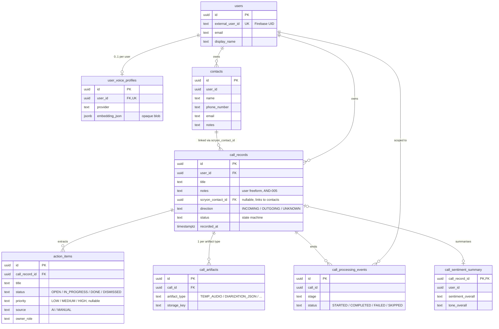

# Data model

Scryon's relational store is Postgres. The schema is owned by Flyway migrations in `scryon-backend/src/main/resources/db/migration/`. All tables use UUID primary keys, `created_at` / `updated_at` timestamps, and per-user scoping.

## Entity-relationship diagram

## Tables at a glance

| Table | Purpose | Notes |
|---|---|---|
| `users` | Authenticated user accounts. | `external_user_id` (Firebase UID) is unique. |
| `call_records` | One row per uploaded call. | Drives the state machine. Indexed on `(user_id, created_at desc)`. |
| `call_artifacts` | One piece of content stored in object storage. | `(call_id, artifact_type)` unique. |
| `action_items` | Extracted + user-created action items. | Owner fields capture speaker + role + display name; `priority` / `source` added in V19. |
| `contacts` | User-owned address-book entries. | See [API · Contacts](../api/contacts.md). Linked to calls via `call_records.scryon_contact_id`. |
| `call_sentiment_summary` | One row per completed call, denormalising `sentiment` / `tone` for analytics. | Backs [`GET /api/analytics/vibe`](../api/analytics.md). |
| `user_voice_profiles` | Optional voiceprint per user. | At most one row per user; `consent_version` tracks consent UX. |
| `call_processing_events` | Pipeline event log. | High-cardinality; retention policy enforced by sweeper. |

## `users`

| Column | Type | Notes |
|---|---|---|
| `id` | `uuid` PK | Server-generated. |
| `external_user_id` | `text` UNIQUE | Firebase UID, or `local-dev`. |
| `email` | `text` | Nullable; sourced from Firebase claims. |
| `display_name` | `text` | Used by the speaker resolver. |
| `created_at` / `updated_at` | `timestamptz` | |

## `call_records`

| Column | Notes |
|---|---|
| `id` (PK) | The `callId` surfaced to clients. |
| `user_id` (FK) | Owner. |
| `title` | Free-form. User-editable via `PATCH /api/calls/{id}` (AND-003). |
| `notes` | User freeform notes (AND-005 / BE-008, added V20). Distinct from the AI analysis — never generated by the LLM. |
| `contact_name` / `contact_id` / `phone_number` / `organization` | Counterparty metadata sourced from the Android call log at upload time. `contact_id` here is the platform `ContactsContract._ID`, unrelated to `scryon_contact_id`. |
| `scryon_contact_id` | Nullable FK-style link (no DB constraint) to `contacts.id` (added V18). Set by auto-assign at upload or by `PATCH /api/calls/{callId}/contact`. |
| `direction` | `INCOMING` / `OUTGOING` / `UNKNOWN`. |
| `recorded_at` | Client-supplied; otherwise upload time. |
| `duration_seconds` | Best-effort. |
| `status` | State machine. |
| `error_reason` | Short opaque code on `FAILED`. |
| `created_at` / `updated_at` | |

## `call_artifacts`

| Column | Notes |
|---|---|
| `id` (PK) | |
| `call_id` (FK) | |
| `artifact_type` | Enum: `TEMP_AUDIO`, `DIARIZATION_JSON`, `RAW_TRANSCRIPT_JSON`, `NORMALIZED_TRANSCRIPT_JSON`, `ANALYSIS_JSON`. |
| `storage_key` | Logical path in object storage. See [Storage layout](storage-layout.md). |
| `content_type` | MIME type of the bytes. |
| `byte_size` | Total bytes. |
| `created_at` | |

## `action_items`

| Column | Notes |
|---|---|
| `id` (PK) | |
| `call_record_id` (FK) | |
| `title` | |
| `description` | |
| `due_date` | `date`, may be null. |
| `priority` | `LOW` / `MEDIUM` / `HIGH`, nullable (added V19; null on rows extracted before it existed). |
| `status` | `OPEN` / `IN_PROGRESS` / `DONE` / `DISMISSED`. Renamed from the legacy `PENDING` / `COMPLETED` two-state model in V19 — old values are back-filled, not accepted on new writes. |
| `source` | `AI` (pipeline-extracted) or `MANUAL` (user-created via `POST /api/calls/{callId}/action-items`). Added V19; back-filled to `AI` for pre-existing rows. |
| `contact_id` | Nullable, added V19 for future per-contact action-item queries. Partially indexed. |
| `owner_speaker_id` / `owner_speaker_label` / `owner_display_name` / `owner_role` | Set from `ActionItemOwnerMapper`. |
| `source_segment_ids_json` | JSON array of source segment IDs. |
| `source_text` | Provenance for explainability. |
| `created_at` / `updated_at` / `completed_at` | |

See [API · Action items](../api/action-items.md) for the full request/response contract.

## `contacts`

User-owned address-book entries, independent of Android's system contacts. Added V17.

| Column | Notes |
|---|---|
| `id` (PK) | |
| `user_id` | No FK constraint (matches existing schema convention). |
| `name` | Required. Case-insensitive match key for [auto-assignment](../api/contacts.md#auto-assignment-on-upload). |
| `phone_number` / `email` / `notes` | Optional. |
| `created_at` / `updated_at` | |

See [API · Contacts](../api/contacts.md).

## `call_sentiment_summary`

One row per completed call, denormalising the `sentiment` / `tone` fields from `ANALYSIS_JSON` so [`GET /api/analytics/vibe`](../api/analytics.md) doesn't have to deserialise every artifact on every request. Added V21.

| Column | Notes |
|---|---|
| `call_record_id` (PK, FK) | `ON DELETE CASCADE` from `call_records`. |
| `user_id` | Scope; indexed with `recorded_at` for the analytics window query. |
| `recorded_at` | Copied from the call, for windowed trend queries. |
| `sentiment_overall` / `user_sentiment` / `contact_sentiment` | Copied from `Sentiment.overall` / `userSentiment.overall` / `contactSentiment.overall`. |
| `tone_overall` / `tone_formality` / `tone_energy` / `tone_pace` | Copied from `Tone`. |
| `created_at` | |

## `user_voice_profiles`

| Column | Notes |
|---|---|
| `id` (PK) | |
| `user_id` (FK, unique) | |
| `provider` | e.g. `pyannote`. |
| `model` / `model_version` | Provenance. |
| `embedding_json` | Opaque provider blob. **Not a vector we own** — we don't decode it. |
| `consent_version` | Matches `SCRYON_VOICE_CONSENT_VERSION` at create time. |
| `sample_duration_seconds` | For UX hints. |
| `created_at` / `updated_at` | |

## `call_processing_events`

| Column | Notes |
|---|---|
| `id` (PK) | |
| `call_id` | FK-style, nullable for non-call events. |
| `user_id` | Scope. |
| `stage` | Enum from `ProcessingStage`. |
| `status` | `STARTED`, `COMPLETED`, `FAILED`, `SKIPPED`. |
| `provider` | When applicable. |
| `duration_ms` | Set by `ProcessingEventLogger` at end of stage. |
| `error_code` | Short opaque code. |
| `error_message` | Sanitized. |
| `created_at` | |

## Conventions

- **All FKs are `ON DELETE CASCADE`** when the child is owned (artifacts, events, action items).
- **No raw audio bytes are ever stored in Postgres** — only object-storage keys.
- **Timestamps are UTC**. Hibernate `time_zone=UTC` is set explicitly.
- **JSON columns use `jsonb`** so we can index and query without serialisation overhead.

See [Database migrations](../development/database-migrations.md) for how the schema evolves.
