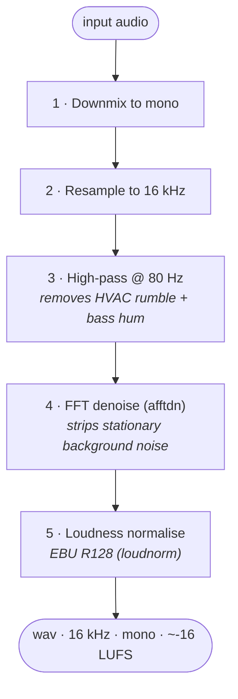

# Audio preprocessing

A short ffmpeg pipeline runs before audio is sent to diarization and transcription. Good preprocessing is the single highest-leverage fix for poor Whisper accuracy and over-segmented diarization.

> **Feature flag.** `SCRYON_AUDIO_PREPROCESSING_ENABLED=true` (default). If `ffmpeg` is missing or fails, the worker falls back to the original audio — the call still completes.

## What the pipeline does

Resulting audio is the input to the rest of the pipeline.

## Why each step

| Step | Why |
|---|---|
| Mono downmix | Whisper expects mono. Cheap to do once. |
| 16 kHz resample | Whisper's native rate. Saves bandwidth + provider cost. |
| High-pass 80 Hz | HVAC rumble + AC compressor noise pyannote loved to classify as a separate speaker. |
| FFT denoise | Stationary background noise (fans, traffic) leaks into segments and confuses Whisper. |
| Loudness normalise | Some Android recorders record at ‑35 dBFS. Whisper's accuracy on low-volume audio collapses. |

## Tuning knobs

| Variable | Default | Effect |
|---|---|---|
| `SCRYON_AUDIO_DENOISE_ENABLED` | `true` | Turn the denoise step off entirely. |
| `SCRYON_AUDIO_HIGHPASS_HZ` | `80` | Raise to ~120 Hz for tinny recordings; lower to 50 Hz to preserve male voice fundamentals. |
| `SCRYON_AUDIO_DENOISE_NR_DB` | `12` | Strength of noise reduction in dB. Raising past ~20 dB starts clipping quiet speech. |
| `SCRYON_AUDIO_DENOISE_NOISE_FLOOR_DB` | `-25` | Estimated noise floor. Adjust if you know the source. |
| `SCRYON_AUDIO_PREPROCESSING_OUTPUT_FORMAT` | `wav` | `wav` is largest but lossless. `mp3` halves the upload size. |
| `SCRYON_AUDIO_PREPROCESSING_TIMEOUT_SECONDS` | `60` | Per-file ffmpeg deadline. |

## When to turn things off

| Symptom | Try |
|---|---|
| Quiet speech disappears | Turn `denoiseEnabled` off, or lower `denoiseNrDb` to 6–8 dB. |
| Loud peaks distort | The loudnorm pass should prevent this; if not, the input is already clipped — re-record. |
| ffmpeg missing on host | Install ffmpeg (recommended) or set `SCRYON_AUDIO_PREPROCESSING_ENABLED=false`. |

## Failure behaviour

- ffmpeg missing → log a warning once, fall back to the original audio for all calls.
- ffmpeg fails on a specific file → log the file's metadata, fall back for just that file.

In both cases the call still completes — just on the unprocessed audio. The metric `scryon.audio.preprocessing.fallback{reason=...}` is incremented so you can alert on widespread failures.

## Code map

| Service | File |
|---|---|
| `AudioPreprocessingService` | Builds the filter chain and runs ffmpeg. |
| `ScryonProperties.AudioPreprocessing` | Configuration shape. |

## Telemetry

- `scryon.audio.preprocessing.duration` (timer)
- `scryon.audio.preprocessing.fallback{reason}` (counter)
- `event=PIPELINE stage=AUDIO_PREPROCESSED status=COMPLETED durationMs=...`
