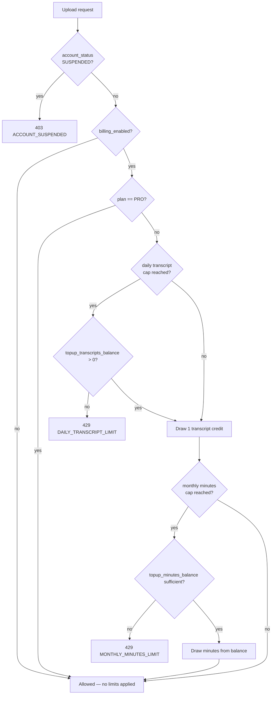

# Plans & billing

Scryon has two account tiers — **Free** and **Pro** — plus one-time minute-and-transcript top-ups for Free accounts. All limits are config-driven (`ScryonProperties.Plans`), never hardcoded in a controller or in the Android client.

> **Feature flag.** The whole system is gated by the admin-controlled `billing_enabled` flag (see [Admin console](../admin/overview.md)) — a different kind of flag from the `SCRYON_*_ENABLED` env vars used elsewhere in these docs. It is seeded **off**: the code is fully implemented and live, but every account behaves as if it had no limits at all until an admin turns it on. When off, `PlanUsageService.checkBeforeUpload` short-circuits before touching plan/usage logic at all, and no Plans/Billing UI shows anywhere in the Android app.

## The two tiers

| | Free | Pro |
|---|---|---|
| Minutes / month | 150 | 1,000 |
| Transcripts / day | 3 | Unlimited (no daily rail) |
| Price | $0 | $9.99/mo |
| Over the included minutes | Blocked until reset or top-up | Never blocked — tracked for future invoicing, billed at $0.025/min |

Every account starts on Free — there is no "not yet chosen" state. A Free account that upgrades to Pro loses both hard caps immediately; going the other direction (admin-only, see below) reinstates them.

## Top-ups (Free only)

A Free account that hits either cap can buy a top-up. Minutes and transcripts are bundled together in every SKU — a purchased minute top-up would be stranded if the daily transcript cap still blocked every upload, so each SKU also grants a transcript allowance.

| SKU | Minutes | Transcripts | Price |
|---|---|---|---|
| `topup_60min` | 60 | 5 | $1.99 |
| `topup_150min` | 150 | 12 | $3.99 |
| `topup_400min` | 400 | 30 | $7.99 |

Top-up balances (`users.topup_minutes_balance` / `users.topup_transcripts_balance`) never expire and are spent before the base allowance resets — see [Data model](../architecture/data-model.md#users).

## Enforcement

`PlanUsageService.checkBeforeUpload(user, durationSeconds)` runs as part of every `POST /api/calls/analyze`, before the upload is accepted:

Usage (`minutesUsedThisPeriod`, `transcriptsToday`) is always computed live from `call_records` — never a separate counter — so there's nothing to reconcile when `billing_enabled` flips in either direction. See [`GET /api/users/me/limits`](../api/users.md#get-apiusersmelimits) for the response an Android/dashboard client reads to render this.

An account can also be **suspended** or **disabled** by an admin, independent of billing — see [Admin console](../admin/overview.md#account-status) for the ACTIVE / SUSPENDED / DISABLED distinction and how it interacts with this check.

## What the Android app shows

All Plans/Billing UI is conditionally rendered on `GET /api/feature-flags`'s `billing_enabled` value, fetched once per app launch alongside the user profile:

- **First-login Plans intro** — shown once per account, only if billing is on.
- **Profile → Plans & Billing row** — hidden entirely (not greyed out) when billing is off.
- **Limits screen's plan usage card** — same.

See [`GET /api/plans`](../api/admin.md#get-apiplans) for the catalog endpoint the Plans screen renders — the client never hardcodes a price or limit.
