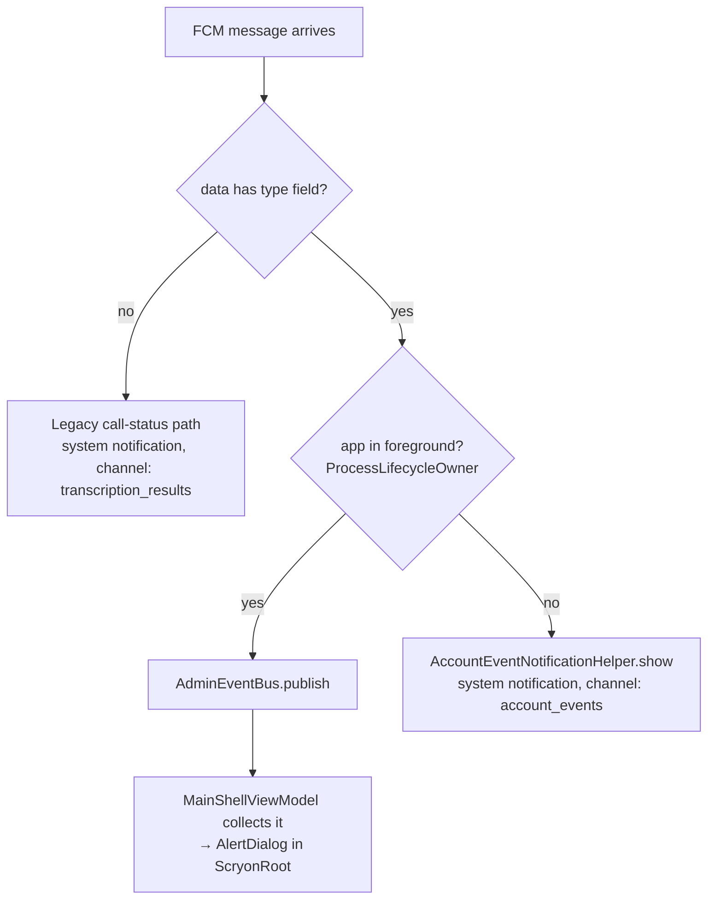

# Push notifications (FCM)

The backend pushes to the Android app via Firebase Cloud Messaging (FCM) for two kinds of events: a call reaching a terminal state, and an admin acting on the account. This page covers both ends of that pipe. It's distinct from [new-recording notifications](../android/notifications.md), which are entirely local (MediaStore-driven, no server involved).

## Backend: `FcmPushService`

One service (`com.scryon.notifications.FcmPushService`), reused by both the call pipeline and the admin surface. Same design in every method:

- **Best-effort, never throws.** Every send is wrapped in a catch-all; a Firebase API error or an invalid/expired token is logged and swallowed. A push failure never fails the HTTP request that triggered it (e.g. an admin's `grant-credits` call still returns `200` even if the push itself fails).
- **No-op when unconfigured.** The bean is always registered; if `FirebaseApp` isn't wired (no `FIREBASE_CLIENT_EMAIL`/`FIREBASE_PRIVATE_KEY` — the same credentials already documented in [Authentication](../api/authentication.md)), every send silently does nothing. No separate config surface for push versus auth.
- **No-op on a missing token.** `users.fcm_token` is null until the client registers one (see below); a null/blank token skips the send.
- **Synchronous.** `FirebaseMessaging#send` is called inline, not queued — every delivery outcome is immediately visible in logs. Fine at Scryon's current volume; would need `@Async` or a queue for a bulk-admin-action scenario.
- **Data-only messages, HIGH priority.** No `setNotification()` — a data-only message reaches `onMessageReceived()` even when the Android app is killed, and the client builds its own notification UI (title, body, actions). `AndroidConfig.Priority.HIGH` wakes the device from Doze; without it, FCM batches delivery until the user next opens the app.

## Message types

| `type` field | Sent from | Payload |
|---|---|---|
| *(absent)* | `CallProcessingService`, on `COMPLETED`/`FAILED` | `callId`, `status`, `title`, `body` |
| `account_status` | `PlanUsageService.adminSetAccountStatus` | `status` (`ACTIVE`/`SUSPENDED`/`DISABLED`), `title`, `body` |
| `credits_granted` | `PlanUsageService.adminGrantCredits` | `title`, `body` (pre-formatted, e.g. "You've received 250 bonus minutes and 10 bonus transcripts.") |
| `plan_changed` | `PlanUsageService.adminChangePlan` | `plan`, `title`, `body` |

Legacy call-status pushes predate the `type` field and don't carry one — Android's dispatch (below) treats a missing `type` as "this is a call-status push," so old and new messages coexist without a client update.

`title`/`body` are always composed server-side (see the individual `send*Push` methods) — the client never derives user-facing copy from a raw enum value.

## Android: dispatch and the foreground/background split

`ScryonFirebaseMessagingService.onMessageReceived()` branches on `data["type"]` before falling through to the legacy `callId`/`status` handling. For the three admin-event types, `handleAdminEvent()` checks `ProcessLifecycleOwner.get().lifecycle.currentState.isAtLeast(Lifecycle.State.STARTED)`:

For `account_status` specifically, `handleAdminEvent` also fires `userRepository.refreshProfile()` in the background regardless of foreground state — so `GET /api/users/me`'s `accountStatus`/`accountStatusReason` (see [API · Users](../api/users.md)) is current the moment the user next looks at any status-gated screen, without waiting for a natural refresh trigger.

- **`AdminEventBus`** (`com.scryon.notifications`) — an app-scoped Hilt singleton wrapping a `MutableSharedFlow<AdminPushEvent>`. Same shape as the pre-existing `ActionMutationBus` pattern used elsewhere in the app.
- **`AccountEventNotificationHelper`** — a new `"account_events"` notification channel (`IMPORTANCE_HIGH` — more time-sensitive than a completed transcription), separate from the existing `"transcription_results"` and `"plan_limits"` channels.

## Suspended-account uploads: reusing the plan-limit dialog

A SUSPENDED account that tries to upload anyway gets a `403 ACCOUNT_SUSPENDED` from `POST /api/calls/analyze`. This doesn't go through the FCM path at all — it's a synchronous HTTP response, handled the same way a `429` plan-limit rejection already was: `CallUploadWorker` catches it, shows a notification via `PlanLimitNotificationHelper`, and sets `KEY_FAILURE_REASON`/`KEY_FAILURE_MESSAGE` on the worker's output data, which `MainShellViewModel` already picks up and turns into the existing `planLimitDialog` `AlertDialog` when the app is foregrounded. No new dialog machinery — `ScryonError.Forbidden` (the client-side mapping for HTTP `403`, added alongside this feature) just feeds the same pipe `ScryonError.TooManyRequests` already used.

## Token lifecycle

`ScryonFirebaseMessagingService.onNewToken(token)` registers the new token via `PATCH /api/users/me { fcmToken }` — the same endpoint documented in [API · Users](../api/users.md). `AuthGateViewModel.ensureUserProvisioned()` also does this once per sign-in as a fallback, in case `onNewToken` never fired for a token issued before the user was authenticated.

## Related

- **[Admin console](../admin/overview.md)** — what triggers `account_status`/`credits_granted`/`plan_changed` pushes.
- **[Android notifications](../android/notifications.md)** — the other, purely-local notification system.
- **[Authentication](../api/authentication.md)** — the Firebase credentials FCM reuses.
