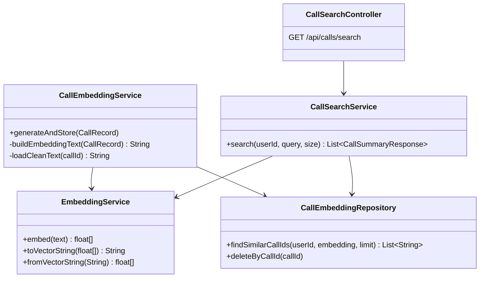
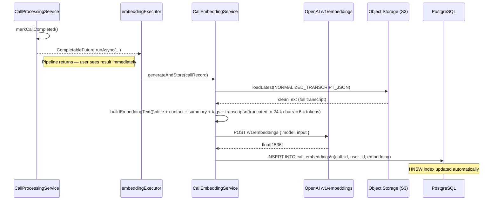
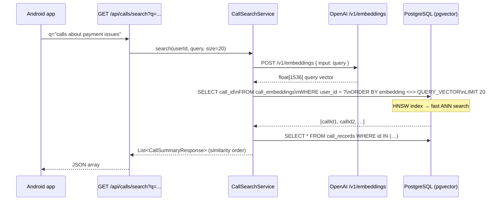
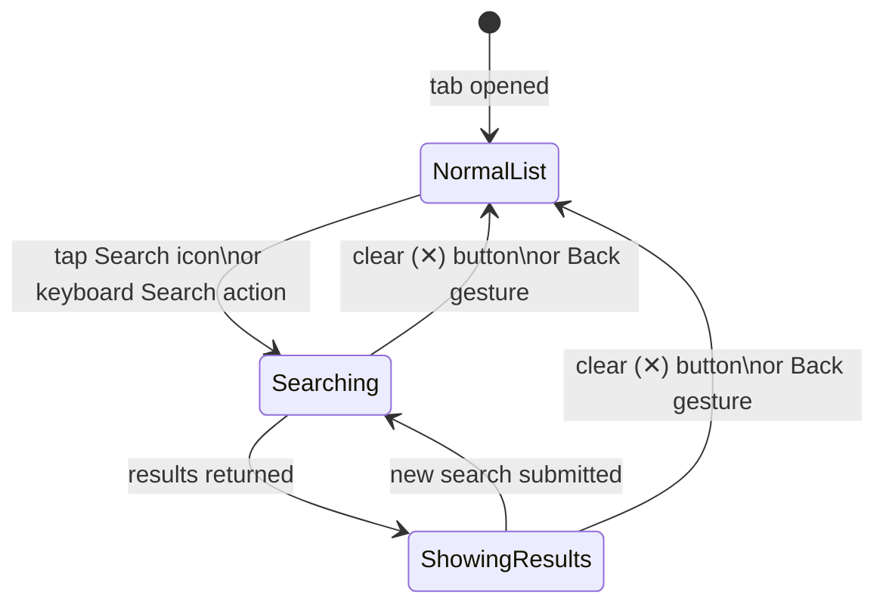

# Semantic Search

Semantic search lets users find calls **by meaning** rather than exact words. Typing "calls about payment issues" surfaces calls where someone discussed outstanding invoices, pending dues, or billing problems — even if those exact phrases never appeared in the transcript.

> **Feature flag.** `SCRYON_EMBEDDING_ENABLED=true` activates the embedding pipeline. When off, `GET /api/calls/search` returns an empty list gracefully. Uses the same `LLM_API_KEY` and `LLM_BASE_URL` as LLM analysis — no new secrets required.

---

## How it works

Each completed call gets a **vector embedding** — a list of 1,536 numbers that encodes the semantic meaning of the call's content. At search time, the query is embedded the same way and the calls with the closest vectors are returned.

```mermaid
flowchart LR
    subgraph Index["Indexing (after analysis)"]
        A[Call completed] --> B[Build text blob\ntitle + contact +\nsummary + transcript]
        B --> C[POST /v1/embeddings\ntext-embedding-3-small]
        C --> D[float[1536] vector]
        D --> E[(call_embeddings\nPostgres + pgvector)]
    end

    subgraph Query["Search"]
        F[User types query\nin Transcribed tab] --> G[Tap Search]
        G --> H[POST /v1/embeddings\nsame model]
        H --> I[query vector]
        I --> J["SELECT call_id\nORDER BY embedding <=> query\nLIMIT 20"]
        J --> K[Ranked call list]
    end

    E --> J
```

---

## Architecture

### Components



### Embedding pipeline (write path)

Triggered asynchronously after every successful call analysis. Runs on a dedicated `embeddingExecutor` thread pool (1–4 threads) separate from the main `callProcessingExecutor` so slow OpenAI API calls never delay in-flight transcriptions.



### Search pipeline (read path)



---

## Database schema

Added in **V15 migration**.

```sql
CREATE EXTENSION IF NOT EXISTS vector;

CREATE TABLE call_embeddings (
    id         UUID PRIMARY KEY DEFAULT gen_random_uuid(),
    call_id    UUID NOT NULL REFERENCES call_records(id) ON DELETE CASCADE,
    user_id    UUID NOT NULL,
    embedding  vector(1536) NOT NULL,
    created_at TIMESTAMPTZ NOT NULL DEFAULT NOW()
);

-- Fast point-lookup when re-embedding a single call
CREATE UNIQUE INDEX ON call_embeddings(call_id);

-- HNSW index for approximate nearest-neighbour cosine search
CREATE INDEX ON call_embeddings USING hnsw (embedding vector_cosine_ops);
```

The `<=>` operator is pgvector's cosine distance. Cosine similarity is preferred over Euclidean distance for text embeddings because it measures angle (meaning direction) rather than magnitude.

---

## What gets embedded

Each call's embedding text is built from fields already in the database, plus the full transcript loaded from object storage:

```
Title: {title}
Contact: {contact_name}
Organisation: {organization}
Summary: {short_summary}
Tags: {tag1, tag2, ...}
Transcript:
{cleanText — truncated to 24,000 chars ≈ 6,000 tokens}
```

The `cleanText` field comes from the `NORMALIZED_TRANSCRIPT_JSON` artifact (already in S3 from the transcription pipeline). Loading it for embedding is a one-time read; subsequent searches use only the stored vector.

---

## Model and cost

| Parameter | Value |
|-----------|-------|
| Model | `text-embedding-3-small` |
| Dimensions | 1,536 |
| Max input tokens | 8,191 |
| Cost | ~$0.02 / 1M tokens |
| Cost per 10-min call | ~$0.00007 |
| Cost per 1,000 calls | ~$0.07 |

---

## Android UI

The search bar lives at the top of the **Transcribed** tab.



**Normal list** — existing behaviour unchanged. All completed calls shown newest first.

**Searching** — loading spinner shown under the search bar while the OpenAI round-trip completes (~150–250 ms total latency).

**Showing results** — ranked results replace the list. A `"Results for '{query}'"` header and a **Clear** button appear. Tapping a result opens the call detail screen as usual.

**No results** — an empty state with a "Clear search" action is shown if the backend found no close matches.

> **Note.** Search fires on **explicit submit** (tap the 🔍 icon or press the keyboard Search key), not as you type. This avoids embedding every partial query and keeps API costs low.

---

## Configuration reference

| Env var | Default | Description |
|---------|---------|-------------|
| `SCRYON_EMBEDDING_ENABLED` | `false` | Master switch. Set to `true` to activate. |
| `SCRYON_EMBEDDING_MODEL` | `text-embedding-3-small` | OpenAI embedding model. |
| `SCRYON_EMBEDDING_TIMEOUT_SECONDS` | `30` | Timeout for the `/v1/embeddings` API call. |
| `LLM_API_KEY` | — | Shared with LLM analysis. **Required.** |
| `LLM_BASE_URL` | `https://api.openai.com/v1` | Override to use a compatible provider. |

---

## Graceful degradation

Every part of the embedding pipeline is best-effort:

| Failure | Behaviour |
|---------|-----------|
| Embedding disabled | `GET /api/calls/search` returns `[]`. App shows empty state. |
| OpenAI API unreachable at index time | Logged as WARN, call still completes, call simply won't appear in search results. |
| OpenAI API unreachable at search time | Logged as WARN, endpoint returns `[]`. |
| Call has no embedding | Silently excluded from search results. |
| pgvector extension not installed | V15 migration fails — backend won't start. Install extension before enabling. |

---

## Enabling on Railway

1. Ensure `LLM_API_KEY` is already set (it should be — it powers LLM analysis).
2. Add `SCRYON_EMBEDDING_ENABLED=true` to Railway environment variables.
3. Redeploy — check logs for `EmbeddingService: embedding enabled (model=text-embedding-3-small)`.
4. Make a test call end-to-end; after analysis completes look for `Embedding stored for call <id>`.
5. Open the Android app → Transcribed tab → search for a phrase from that call.

> **Only new calls** analysed after enabling the flag will be indexed. Existing calls will not appear in search results unless re-processed.

---

## Related

- [LLM analysis](analysis.md) — shares the same OpenAI credentials
- [Call processing pipeline](../architecture/call-processing-pipeline.md) — where the embedding hook lives
- [Data model](../architecture/data-model.md) — `call_embeddings` table
