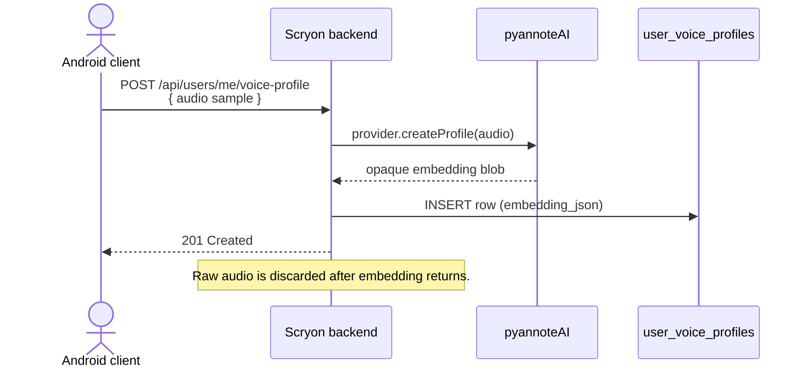
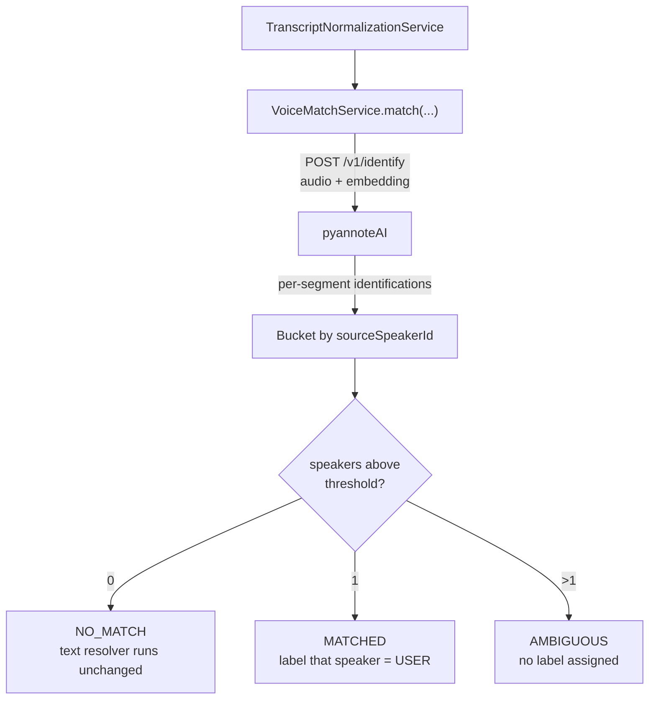

# Voice embedding

Voice embedding lets Scryon identify *which* of the diarized speakers is the authenticated user, using the user's stored voice profile.

> **Feature flag.** Off by default. Enable with `SCRYON_VOICE_EMBEDDING_ENABLED=true`. When off, every voice-profile endpoint returns `404 feature_not_available` and the call pipeline skips voice matching entirely.

## Why this exists

The text-only [speaker resolver](speaker-resolution.md) is reliable when speakers say each other's names. It struggles when:

- Neither speaker greets the other by name.
- One speaker mentions both names (e.g. "Hi this is Ravi calling for Praveen").
- The transcript is short or non-English.

Voice matching adds a strong, language-independent signal: *this voice = the phone owner*.

## End-to-end flow

### Onboarding (one-time)

### At every call (automatic)

## Match thresholds

| Score range | Outcome |
|---|---|
| `≥ SCRYON_VOICE_EMBEDDING_HIGH_THRESHOLD` (default 0.85) | `MATCHED`, confidence `HIGH`. |
| `≥ SCRYON_VOICE_EMBEDDING_MEDIUM_THRESHOLD` (default 0.75) | `MATCHED`, confidence `MEDIUM`. |
| `< MEDIUM_THRESHOLD` | `NO_MATCH`. Text resolver runs unchanged. |
| More than one speaker over threshold | `AMBIGUOUS`. No label assigned. |

## Privacy contract

- The voice sample is **not retained** after the provider returns the embedding.
- The embedding is stored as an opaque provider blob in `user_voice_profiles.embedding_json`. Scryon does not decode it.
- The `voiceMatchScore` exposed on transcripts is a single float — no biometric data leaks.
- Users can delete their profile at any time with `DELETE /api/users/me/voice-profile`. Deletion is best-effort against the provider too.
- Account deletion (`DELETE /api/users/me`) removes the voice profile alongside everything else.

## When voice matching does *not* run

- Feature flag off.
- Provider not configured / unavailable.
- User has no profile.
- Call has no diarization output (diarization disabled or fell back).
- Provider returns an error → soft failure, telemetry-only.

In every case the text resolver runs and produces a best-effort transcript.

## How the result reaches the transcript

When `VoiceMatchService` matches exactly one speaker:

1. That speaker is pre-labelled `role=USER`, `labelSource=VOICE_EMBEDDING`.
2. `voiceMatchScore` is set on the speaker.
3. The text resolver fills in the user's display name on that speaker.
4. The other speaker is resolved as `CONTACT` via by-elimination.

When the match is ambiguous, the text resolver runs unchanged, but the `speakerResolution.voiceMatchStatus = AMBIGUOUS` field tells the client it was tried.

## Telemetry

| Signal | Tags |
|---|---|
| `scryon.voice.profile.created` | counter |
| `scryon.voice.profile.deleted` | counter |
| `scryon.voice.match.attempted` | counter |
| `scryon.voice.match.outcome{outcome}` | `matched` / `no_match` / `ambiguous` |
| `scryon.voice.match.failed{cause}` | provider error class |
| `scryon.voice.embedding.provider.duration` | timer |

Logs:

- `event=VOICE_MATCH_STARTED callId=... provider=pyannote`
- `event=VOICE_MATCH_COMPLETED callId=... outcome=... score=... providerMs=...`
- `event=VOICE_MATCH_SKIPPED callId=... reason=...`

## Code map

| Service | File |
|---|---|
| `VoiceMatchService` | Per-call orchestration. |
| `VoiceEmbeddingProvider` | Provider interface. |
| `PyannoteVoiceEmbeddingProvider` | pyannote implementation. |
| `DisabledVoiceEmbeddingProvider` | No-op fallback. |
| `UserVoiceProfileService` | CRUD around `user_voice_profiles`. |
| `UserVoiceProfileController` | REST endpoints. |
