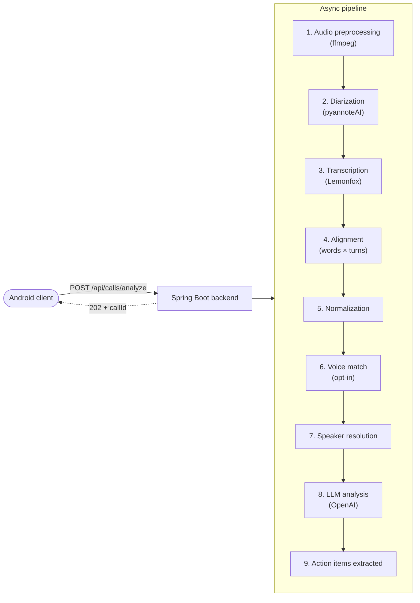

# Overview

Scryon is a privacy-first call intelligence backend. You upload a phone-call recording and Scryon produces:

1. A **speaker-attributed transcript** with stable speaker IDs, time-coded segments, and word-level confidence.
2. A **structured analysis** of the call — a summary, key points, action items with owners and due dates, sentiment, topics, and follow-ups.
3. **Action items** persisted as first-class objects you can list, complete, and snooze.

Everything runs as a single Spring Boot service backed by Postgres for state and S3-compatible object storage for artifacts.

## Who Scryon is for

- **Sales teams** that want call summaries and action items without a meeting bot or screen recorder.
- **Field-ops and CX teams** that record customer calls on Android and want them mined for insight.
- **Builders** integrating call intelligence into their own products via a REST API.

## Design principles

1. **Privacy by construction.** Raw audio is never persisted — it lives in-memory only long enough to be processed and then deleted from the temp-audio bucket within hours. See [Privacy & security](../privacy-and-security.md).
2. **Provider-agnostic pipeline.** Diarization, transcription, and analysis each sit behind a small interface so a provider swap is a config change.
3. **Async by default.** The HTTP layer returns a `callId` in milliseconds; the actual work happens on a background worker with idempotent state transitions.
4. **No hallucination of identity.** Speakers are only named when the evidence (call metadata + transcript text + optional voice match) is strong. Weak evidence → `Speaker N` at `LOW` confidence.
5. **Observability is not optional.** Every pipeline stage emits a structured event, a metric, and (when configured) an OpenTelemetry span. Sentry receives privacy-scrubbed errors.

## End-to-end flow

Each stage is documented under [Features](../features/diarization.md). The runtime orchestration lives in `CallProcessingService`.

## What's next

- **[Quickstart](quickstart.md)** — make your first call analysis in 5 minutes.
- **[Local setup](local-setup.md)** — run the backend on your laptop.
- **[Configuration reference](configuration.md)** — every environment variable in one place.
