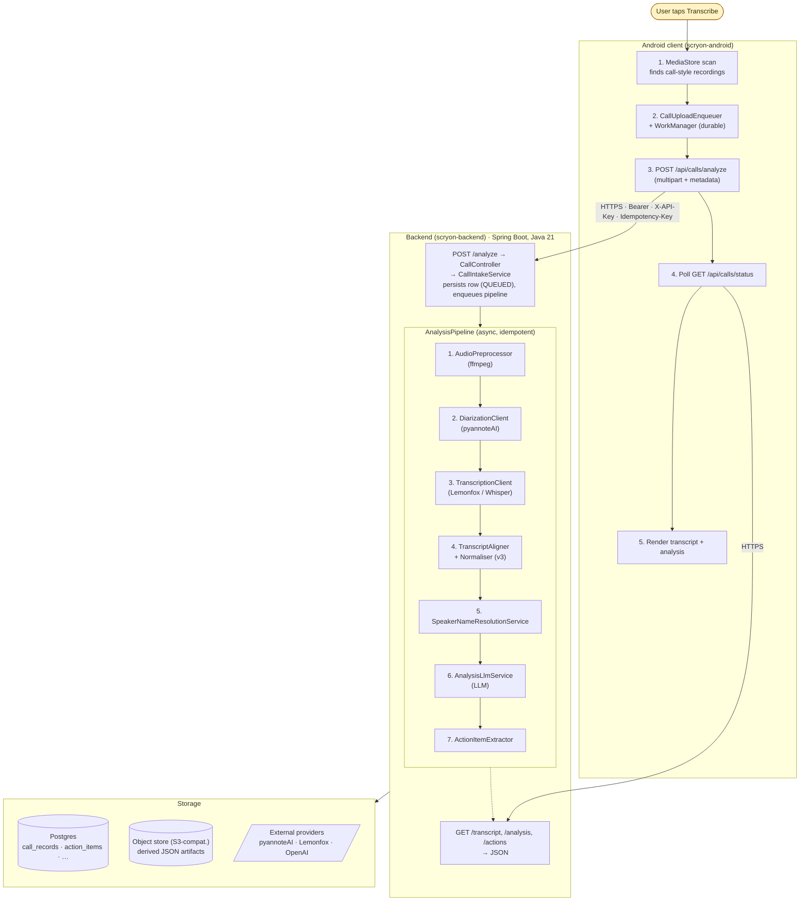

# Onboarding

Welcome. This section is for engineers who will be working on Scryon — either the **Spring Boot backend** or the **Android client**, and usually both at some point.

It exists so that on day one you have:

- A clear picture of what Scryon is and the problems we are solving.
- A 30-minute mental model of the pipeline before you read any code.
- A first PR that takes hours, not days.
- An explicit, repeatable plan for your first week and first month.

If this is your first hour, **read this page top to bottom**, then jump into one of the role-specific tracks at the end.

---

## What Scryon is, in 60 seconds

> Scryon takes a phone-call recording and produces a clean, speaker-named transcript and a structured analysis (summary, key points, action items, sentiment). The Android app discovers recordings already on the device and lets the user upload them on demand. The backend runs an async pipeline (preprocess → diarize → transcribe → align → resolve speakers → analyse) and exposes a tight REST surface.

If that 60-second pitch doesn't ring any bells, read the [main README](../README.md) for the longer narrative — *the idea, the problem, the solution, the vision, and our core principles* — and then come back here.

---

## Principles you will hear quoted in code review

These are the rules we apply when we disagree. We will return to them often.

1. **Privacy is non-negotiable.** Raw audio never persists past the pipeline. PII never lands in logs, metrics, or Sentry. Deletion is real.
2. **Reliability is a product feature.** Async, idempotent, resumable. Workers restart. Uploads carry an `Idempotency-Key`. Boring infrastructure wins.
3. **Accuracy beats coverage.** Diarization first, transcription second. Refuse to guess speakers; `role=UNKNOWN` is correct when the evidence is weak.
4. **The user is in control.** Explicit uploads, per-user namespacing, opt-in features stay opt-in.
5. **Boringly simple wins.** Package by feature. No abstractions until we are bored of repeating ourselves. Comments explain *why*, not *what*.

The full text lives in the [main README](../README.md#core-principles). If you ever propose a design that violates one of these, expect to defend it.

---

## A 30-minute mental model

Here is the whole product, drawn at the napkin level. Read it once and you will be able to follow any conversation.

Bookmark this picture. It tells you where any given concern lives.

---

## The 12 words you need

Speed-read these once. The full glossary lives at [Glossary](glossary.md).

| Word | What it means |
|---|---|
| **Diarization** | Splitting audio into "who spoke when" — not transcription. We use pyannoteAI. |
| **Transcription** | Turning audio into words. We use Lemonfox / Whisper. |
| **Alignment** | Stitching diarization (speakers) with transcription (words) into one timeline. |
| **Normalisation (v3)** | Our stable transcript schema with `segments[]` and `speakers[]`. The client never sees raw provider output. |
| **Speaker resolution** | Mapping anonymous `speaker_0` to a real `role` (USER / CONTACT) and `displayName`. |
| **LabelSource** | The evidence the resolver used: `VOICE_EMBEDDING`, `GREETING_MATCH`, `POSITIONAL_FALLBACK`, … |
| **Voice profile** | An opt-in voice embedding of the user, stored backend-side only. |
| **Action item** | A structured TODO extracted from the call, with owner, due date, and source segments. |
| **Idempotency-Key** | UUID per upload target; the backend dedupes for 24 h. |
| **MDC** | Spring's request-scoped log context. Every log line in the pipeline carries `callId`. |
| **Feature flag** | An env var that gates a feature (e.g. `SCRYON_VOICE_EMBEDDING_ENABLED`). Default off in dev. |
| **AnalysisPipeline** | The async backend chain from "audio uploaded" to "analysis written". |

---

## Pick your track

| If you are joining the … | Go to … |
|---|---|
| **Backend team** (Spring Boot, Java 21, Postgres, the pipeline, observability) | [Backend onboarding](backend.md) |
| **Android team** (Kotlin, Compose, WorkManager, Firebase, the upload pipeline) | [Android onboarding](android.md) |
| **Both** (full-stack) | Start with [Backend onboarding](backend.md), then [Android onboarding](android.md). The backend mental model is the harder one. |

Whichever track you pick, you'll come back here for the glossary, the principles, and the architecture picture.

---

## Your first week, at a glance

This template fits both tracks; the role-specific pages drill into each item.

| Day | Goal |
|---|---|
| **1** | Read this page + the [main README](../README.md). Get your machine set up (JDK 21 + Postgres for backend; Android Studio + Firebase for Android). Run the service or app end-to-end. |
| **2** | Read the relevant role-specific onboarding page top to bottom. Walk through one call end-to-end with logs / logcat open. |
| **3** | Read [Privacy & security](../privacy-and-security.md). This is not optional. Skim [Coding conventions](../development/coding-conventions.md). |
| **4** | Pick a "good first issue" PR. Aim for a small, contained change that touches one file and adds a test. |
| **5** | Submit the PR. Iterate on review comments. Ship it. |

By end of week one you should be able to:

- Describe the pipeline in a 60-second pitch.
- Find any class or screen by name in under 30 seconds.
- Open a PR, run the tests, request review.

---

## Your first month, at a glance

| Week | Goal |
|---|---|
| **1** | First PR shipped. Local dev fluent. |
| **2** | Own one slice end-to-end (a feature, an endpoint, a screen). Read the corresponding docs section thoroughly. |
| **3** | Pair with someone on the *other* surface (backend ↔ Android). Understand how your slice looks from their side. |
| **4** | Take on-call shadow shift (read the [Runbook](../operations/runbook.md), watch alerts, ask questions). |

After a month, you should be productive without supervision — and have at least one architectural opinion of your own about where Scryon should go next.

---

## How we ship

- **Trunk-based.** Short-lived feature branches, PRs merged into `main`, no long-lived release branches.
- **One feature, one PR.** Big changes are split into stacked PRs — see [Contributing](../development/contributing.md).
- **Tests are part of the PR.** No "tests next sprint." If the change is hard to test, that's a design signal.
- **Privacy review is a real review.** Anything that adds a new log line, a new metric label, a new stored field, or a new external call gets explicit privacy sign-off. See [Privacy & security](../privacy-and-security.md).
- **No silent feature flags.** New behaviour ships behind a flag, gets validated, then the flag is removed in a follow-up PR.

---

## Where to ask questions

- **Code questions** — ask in PR review or in the team channel.
- **Architectural questions** — write an ADR ([template](../templates/adr.md)) and propose it; don't shoehorn it into a PR description.
- **Outage / incident questions** — start with [Runbook](../operations/runbook.md) and [Troubleshooting](../operations/troubleshooting.md). When in doubt, ping someone on-call.
- **Doc questions** — open a PR against this repo (`scryon-docs`). Docs are code.

Welcome to the team. Next stop: [Backend onboarding](backend.md) or [Android onboarding](android.md).
