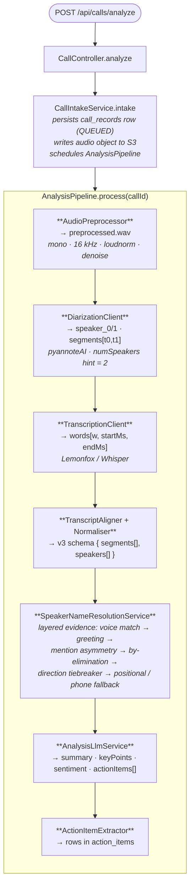

# Backend onboarding

You are joining the team that owns the Spring Boot service that turns audio into transcripts and analyses. This page gets you from "git clone" to "first PR merged" in about a week.

> If you have not yet read the [Onboarding overview](README.md), start there. This page assumes you have the 30-minute mental model.

---

## What you are signing up for

The backend's job, in one paragraph:

> Accept an authenticated multipart audio upload. Persist a `call_records` row. Run an async pipeline that preprocesses the audio (ffmpeg), diarizes (pyannoteAI), transcribes (Lemonfox/Whisper), aligns + normalises into our v3 schema, resolves speaker names using layered evidence, calls an LLM for analysis, and extracts action items. Expose tight, versioned REST endpoints. Never log PII. Be idempotent.

That is *the entire job*. Everything else in the codebase is in service of that loop being **accurate**, **private**, and **boringly reliable**.

---

## The tech

| Layer | Choice | Notes |
|---|---|---|
| Language | **Java 21** | Records, sealed types, pattern matching, virtual threads where it helps. |
| Framework | **Spring Boot 3.x** | Standard stack — `spring-web`, `spring-data-jpa`, `spring-security`, `spring-actuator`. |
| Build | **Gradle (Kotlin DSL)** | Wrapper checked in. JDK 21 is required to build. |
| Database | **PostgreSQL 16** | Flyway-managed migrations. |
| Storage | **S3-compatible** | Tigris in prod, MinIO locally. |
| HTTP client | **WebClient (reactive)** | Non-blocking calls to providers. |
| Observability | Micrometer, OpenTelemetry, Sentry | Prometheus scrape; OTLP traces; Sentry events scrubbed. |
| External APIs | pyannoteAI, Lemonfox/Whisper, OpenAI | Each behind a feature flag in dev. |
| Tests | JUnit 5, Mockito, AssertJ, Testcontainers | Service tests use Testcontainers Postgres. |

---

## Day 1 — get it running

### 1. Prereqs

```bash
# macOS
brew install openjdk@21 postgresql@16 ffmpeg
brew services start postgresql@16

# Verify
java -version          # should print 21
psql --version         # should print 16
ffmpeg -version
```

You also need an S3-compatible store. The simplest is MinIO via Docker:

```bash
docker run -d --name minio -p 9000:9000 -p 9001:9001 \
  -e MINIO_ROOT_USER=minioadmin -e MINIO_ROOT_PASSWORD=minioadmin \
  minio/minio server /data --console-address ':9001'
```

### 2. Clone and configure

```bash
git clone git@github.com:FluxonLabs/scryon-backend.git
cd scryon-backend
cp .env.sample .env.local   # then edit
```

The config surface is documented in [Configuration reference](../getting-started/configuration.md). For a first local run, the bare minimum is:

| Env var | Notes |
|---|---|
| `SCRYON_API_KEY` | Any random string. Used by clients (and your `curl`s). |
| `SPRING_DATASOURCE_URL` | `jdbc:postgresql://localhost:5432/scryon` |
| `SPRING_DATASOURCE_USERNAME` / `PASSWORD` | Local Postgres user |
| `SCRYON_S3_*` | Point at your MinIO |
| `PYANNOTE_ENABLED` | `false` for the first run — uses a stub. Flip to `true` once you have a key. |
| `SCRYON_TRANSCRIPTION_PROVIDER` | `stub` for first run. Switch to `lemonfox` later. |
| `SCRYON_LLM_PROVIDER` | `stub` for first run. Switch to `openai` later. |

### 3. Boot it

```bash
createdb scryon
./gradlew bootRun
```

Flyway migrates on startup. Look for `Successfully applied N migrations` in the logs.

Smoke test:

```bash
curl -H "X-API-Key: $SCRYON_API_KEY" http://localhost:8080/api/health
# {"status":"UP"}
```

### 4. End-to-end with a tiny clip

Generate a 5-second silent WAV and feed it through the pipeline:

```bash
ffmpeg -f lavfi -i anullsrc=r=16000:cl=mono -t 5 sample.wav

curl -X POST http://localhost:8080/api/calls/analyze \
  -H "X-API-Key: $SCRYON_API_KEY" \
  -H "X-Local-User-Id: local-dev" \
  -F "file=@sample.wav" \
  -F "fileName=sample.wav"
# 202 { "callId": "...", "status": "QUEUED" }
```

Watch the logs and poll `GET /api/calls/{callId}` until `status: COMPLETED`. Open the transcript and analysis endpoints. With stubs you'll get deterministic placeholder content — that's fine.

---

## Day 2 — walk one call end-to-end with logs open

The single most useful thing you can do on day 2 is **follow one real call through the entire pipeline with the log filter `callId=<id>`**.

The pipeline:



Each stage:

- Reads its inputs from the previous stage's persisted artifact (object storage or DB).
- Writes its output as a new artifact.
- Is **idempotent**: if it crashes halfway, the next attempt picks up from the last successful stage.

Read [Call processing pipeline](../architecture/call-processing-pipeline.md) once you have followed a real call. The doc will make twice as much sense after.

### Key files to open

| File | Why |
|---|---|
| `CallController.java` | The HTTP boundary. |
| `CallIntakeService.java` | Where uploads become DB rows. |
| `AnalysisPipeline.java` | The orchestrator. |
| `SpeakerNameResolutionService.java` | The most subtle code in the codebase. Read it slowly. |
| `LabelSource.java` | The grammar of "why did we pick this name?" |
| `TranscriptNormaliser.java` | The v3 schema; the client contract. |
| `application.yml` / `application-*.yml` | The full config surface. |

---

## Day 3 — privacy + conventions

Read these in order:

1. **[Privacy & security](../privacy-and-security.md)** — non-negotiable. Memorise the "hard rules" section. They are enforced in code review.
2. **[Coding conventions](../development/coding-conventions.md)** — Java, naming, package, configuration, logging, error handling, transactions, HTTP client.
3. **[Database migrations](../development/database-migrations.md)** — every schema change is a Flyway file. Naming, rules, local reset.

Privacy-specific gotchas to internalise:

- **Phone numbers are masked** (`+91 98***45`) anywhere they appear in logs or metric labels.
- **Transcript text never appears in metrics** — only counts and durations.
- **Sentry events are scrubbed.** Before you add a new field to an exception or `log.error`, check the scrubber config.
- **Voice embeddings never leave the backend.** Not in API responses, not in logs.

---

## Day 4 — pick a first PR

Look for issues labelled `good first issue` on [the repo](https://github.com/FluxonLabs/scryon-backend/issues). Good candidates:

- A new test for an existing edge case in `SpeakerNameResolutionService`.
- Adding a missing metric or refining an existing label set.
- A small `application.yml` cleanup or a documentation correction.
- A typo or a renamed constant.

Stay away from these for your first PR:

- The pipeline orchestrator.
- Anything that adds a new env var.
- Anything that adds a new external provider.

### PR checklist (memorise)

- [ ] Tests added or updated.
- [ ] No new PII in logs / metrics / Sentry.
- [ ] No new env var without a default and documentation in [Configuration reference](../getting-started/configuration.md).
- [ ] Flyway migration named `V<n>__<snake_case>.sql` and **never** edited after merge.
- [ ] `./gradlew check` passes locally.
- [ ] Commit message describes the *why*, not the *what*.

---

## Day 5 — ship it

Submit, iterate on review, merge. Congratulate yourself.

---

## Week 2 — own a slice

Pick one of these and become the local expert:

| Slice | Where it lives |
|---|---|
| **Diarization** | `DiarizationClient`, [Diarization feature doc](../features/diarization.md) |
| **Transcription** | `TranscriptionClient`, [Transcription feature doc](../features/transcription.md) |
| **Audio preprocessing** | `AudioPreprocessor`, [Audio preprocessing](../features/audio-preprocessing.md) |
| **Speaker resolution** | `SpeakerNameResolutionService`, [Speaker resolution](../features/speaker-resolution.md) |
| **Voice embedding** | `VoiceMatchService`, `UserVoiceProfileService`, [Voice embedding](../features/voice-embedding.md) |
| **Analysis** | `AnalysisLlmService`, `ActionItemExtractor`, [Analysis](../features/analysis.md) |
| **Observability** | Micrometer config, OTLP, Sentry — [Observability](../architecture/observability.md) |

"Own a slice" means: read every file in it, run every test, write a one-pager explaining how it works to someone joining next month.

---

## Week 3 — pair with Android

The backend and the Android app meet at a tight REST contract. Spend a day pairing with someone on the Android team and watching what they have to do to consume your endpoint shapes. You will find at least one thing that should be easier on the client side. Open a PR.

The [Android client section](../android/overview.md) is your reading material here, especially [Upload pipeline](../android/upload-pipeline.md) and [Status lifecycle](../android/status-lifecycle.md).

---

## Week 4 — on-call shadow

Read the [Runbook](../operations/runbook.md) and [Troubleshooting](../operations/troubleshooting.md) cover to cover. Watch the on-call channel for a week. When an alert fires, follow the runbook *yourself* before asking the primary on-call what they would do. Then compare notes.

---

## Reference shelf

Bookmark these:

- **[System overview](../architecture/system-overview.md)** — components and how they talk.
- **[Call processing pipeline](../architecture/call-processing-pipeline.md)** — stages, retries, idempotency.
- **[Data model](../architecture/data-model.md)** — Postgres schema + ERD.
- **[Storage layout](../architecture/storage-layout.md)** — object storage key layout, artifact lifecycle.
- **[Observability](../architecture/observability.md)** — logging, metrics, tracing, error tracking.
- **[API overview](../api/overview.md)** — endpoint surface.
- **[Privacy & security](../privacy-and-security.md)** — the contract, the threat model, GDPR.

---

## Common stumbling blocks

| Symptom | Likely cause | Fix |
|---|---|---|
| `./gradlew bootRun` fails with "Flyway checksum mismatch" | Someone (probably you) edited a migration after it was applied | Never edit a `V<n>__*.sql` after merge. Use a new migration. For local dev, `dropdb scryon && createdb scryon`. |
| 500 on `POST /analyze` with `S3 connection refused` | MinIO not running, or `SCRYON_S3_ENDPOINT` wrong | Start MinIO; double-check the endpoint URL (note `http://` and the port). |
| `pyannoteAI 401` | `PYANNOTE_API_KEY` wrong, or feature not enabled | Verify the key in your `.env.local`; set `PYANNOTE_ENABLED=true`. |
| Pipeline never completes | Stub providers were enabled; the stub returns instantly so check logs for skipped stages | Switch to real providers, or accept the stub output. |
| Tests pass locally, fail in CI | Testcontainers Postgres version mismatch, or a `TestPropertySource` collision | Run `./gradlew clean test`. Check the `TestPropertySource` is unique per test class. |

For anything else, [Troubleshooting](../operations/troubleshooting.md) is more thorough.

---

## What "good" looks like after a month

- You can describe the entire pipeline without notes.
- You have shipped at least 5 PRs that touched non-trivial code.
- You have written or improved one piece of documentation in `scryon-docs`.
- You have an opinion about something we should change — and you wrote an ADR or filed an issue.
- You can take an alert at 2 am and resolve it without paging the rest of the team.

Welcome.
